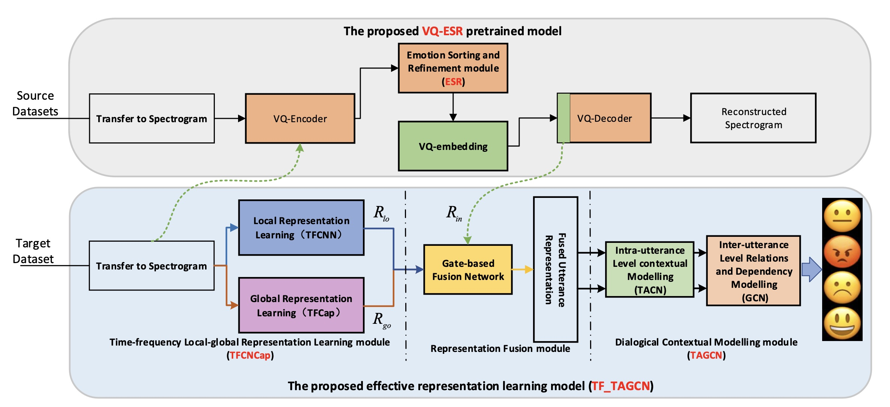

## Time-Frequency Representation Learning with Intrinsic Information for Dialogical Speech Emotion Recognition
> Pytorch and Tensorflow implementation for codes in `Time-Frequency Representation Learning with Intrinsic Information for Dialogical Speech Emotion Recognition`.   

## Overview



## Code Architecture
    .
    ├── tensorflow_implement                # tensorflow implement for codes
        ├─ CNN                              # CNN
            ├─ LSTM
                ├─ step3blstm.py            # step3: train utterance in rnn
            ├─ TCN
                ├─ ...
            ├─ TACN
                ├─ ...
            ├─ step1cnn.py                 # step 1: train spectrograms segment in cnn
            ├─ step2concatSegment.py       # step 2: concat segment as utterance
        ├─ TFCNN                           # time-frequency cnn
            ├─ ...
        ├─ TFCAP                           # time-frequency capsule network
            ├─ ...
        ├─ TFCNCap                         # with(w) TFCNN TFCap, without(wo) VQ-ESR, without GFfusion
            ├─ ...
        ├─ TFCNCap_circ                    # w TFCNN TFCap, w VQ-ESR, wo GFusion
            ├─ ...
        ├─ TFCNCap_buttle                  # w TFCNN TFCap, w VQ-ESR, w GFusion
            ├─ ...
    ├── torch_implement                    # pytorch implement for codes
        ├─ dataset_configs                 # dataset config files for IEMOCAP, MELD with 4 class, MELD with 7 class
            ├─ IEMOCAP.yaml                # IEMOCAP dataset config for intra-utterance model
            ├─ IEMOCAPDIA.yaml             # IEMOCAP dataset config for inter-utterance model
            ├─ MELD.yaml                   # MELD dataset config for intra-utterance model
            ├─ MELDDIA.yaml                # MELD dataset config for inter-utterance model
        ├─ model_configs                   # model config files. See our paper for a detailed explanation
            ...
        ├─ models                          # torch models files 
        ├─ datasets.py                     # customized Dataset class 
        ├─ configs.yaml                    # train config file
        ├─ units.py                        # some code components
## Recommended Requirements
### For tensorflow implement
    h5py                         3.8.0
    hdf5storage                  0.1.19
    keras                        2.11.0
    keras-contrib                2.0.8
    keras-tcn                    3.5.0
    librosa                      0.9.2
    matplotlib                   3.7.0
    numba                        0.56.4
    numpy                        1.23.5
    scikit-learn                 1.2.1
    soundfile                    0.12.1
    tensorflow                   2.11.0

### For pytorch implement
    librosa                  0.9.2
    matplotlib               3.4.3
    multidict                6.0.4
    numba                    0.56.4
    numpy                    1.23.5
    omegaconf                2.3.0
    packaging                23.0
    pandas                   1.4.4
    pytorch-lightning        1.9.0
    PyYAML                   6.0
    scikit-learn             1.2.1
    seaborn                  0.12.0
    six                      1.16.0
    tensorboard              2.7.0
    torch                    1.13.1
    torch-geometric          2.2.0


## Usage for tensorflow implement

1. Datasets 

Download dataset from the following links.

- [IEMOCAP](https://sail.usc.edu/iemocap/)

2. Clone this repo.
```
git clone git@github.com:jxlau1204/tftagcn.git
cd tftagcn
```

3. generate spectrogram
```
please refer to get_intra.m or spectrograms.py
```

4. Run step1, step2, step3, step4 in sequence
```
python tensorflow_implement/CNN/step1cnn.py
python tensorflow_implement/CNN/step2concatSegment.py
python tensorflow_implement/CNN/LSTM/step3blstm.py
python tensorflow_implement/GCNs/step4run.py
```

### Paper
---
Please cite our paper if you find our work useful for your research:
```
@inproceedings{,
  title={Time-Frequency Representation Learning with Intrinsic Information for Dialogical Speech Emotion Recognition},
  year={2023}
}
```
